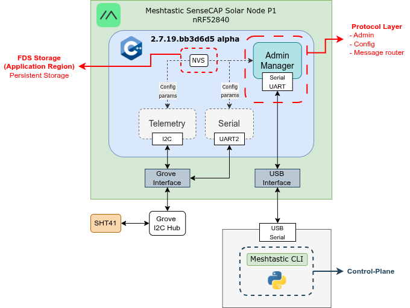
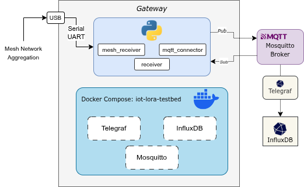
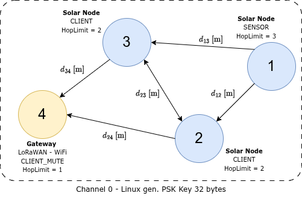
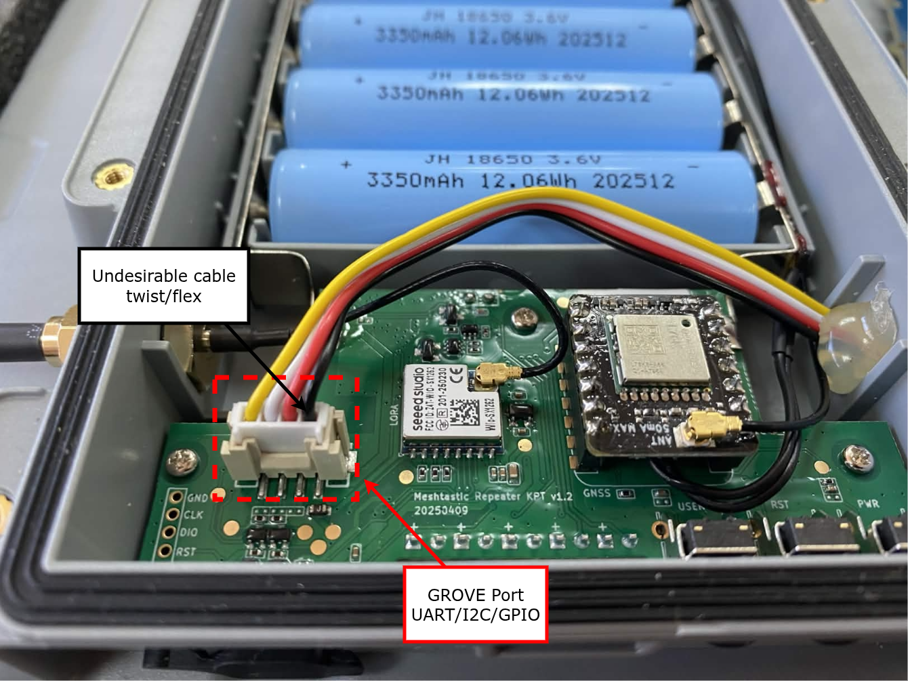
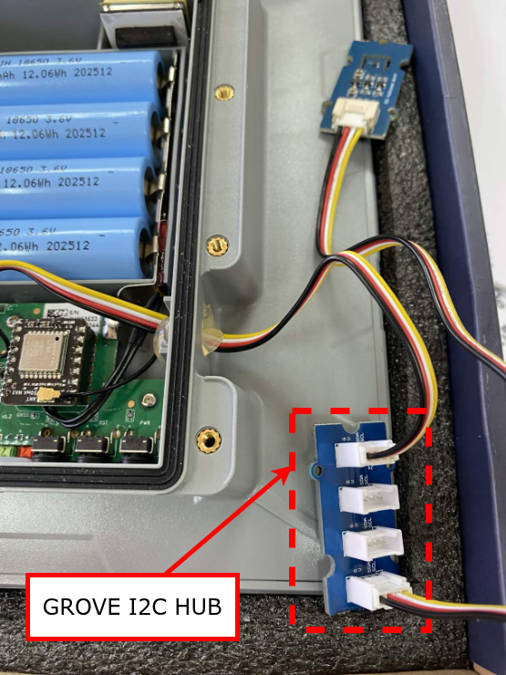

# 🌿 LoRa TestBed Platform

> An early-stage environmental monitoring platform built on LoRa mesh networking and Meshtastic firmware, using solar-powered nodes and a USB-connected gateway.

**Cyber-Physical Systems Research and Technology Center**
[Pontificia Universidad Católica de Chile](https://www.uc.cl)

---

## Overview

This project establishes a LoRa mesh network for environmental monitoring — capturing **temperature, humidity, power metrics, and GPS data** from remote solar-powered nodes. Configuration and control are handled through Python scripts that interface with the [Meshtastic](https://meshtastic.org/) CLI, without modifying the underlying firmware.

The network consists of **3 SensCAP Solar Node P1 Pro sensor nodes** and **1 LILYGO gateway board**, connected via USB to a WiFi-enabled host computer.

---

## Hardware

| Component | Role | Details |
|---|---|---|
| **Seeed Studio SensCAP Solar Node P1 Pro** (×3) | Sensor Nodes | Solar-powered LoRa nodes; temperature & humidity sensing |
| **LILYGO Board** (×1) | Gateway | USB-connected to host; WiFi-enabled |
| **Host Computer** | Control Hub | Runs Python scripts; WiFi access for data forwarding |

### Architecture Diagrams

<table><tr>
<td align="center" width="33%">
  
  <br/><em>SensCAP sensor node</em>
</td>
<td align="center" width="33%">
  
  <br/><em>LILYGO gateway</em>
</td>
<td align="center" width="33%">
  
  <br/><em>Mesh network topology</em>
</td>
</tr></table>

---

## Repository Structure

```
LoRa-TestBed-Platform/
│
├── UF2/
│   ├── erase_firmware/           # UF2 binary to erase existing firmware (nRF52)
│   └── upload_firmware/          # Meshtastic UF2 firmware binary for SensCAP nodes
│
├── docs/                         # Documentation and reference diagrams
│
├── gateway/                      # Gateway-specific configuration
│   ├── config/
│   │   ├── param_receiver.py         # Parameters for the LILYGO gateway
│   │   ├── receiver-config.py        # Script to configure the gateway via Meshtastic CLI
│   │   └── receiver_config.yaml      # Reference YAML config for the gateway
│   ├── mesh_receiver.py
│   ├── mqtt_connector.py
│   ├── param.py
│   └── receiver.py
│
├── node/                         # Node-specific configuration
│   ├── node-config.py                # Configures sensor nodes via Meshtastic CLI
│   ├── param_node.py                 # Shared parameters and constants for sensor nodes
│   ├── config.yaml                   # Reference YAML config for sensor nodes
│   └── firmware_inital_config.yaml   # Initial firmware configuration (pre-channel setup)
│
├── mqtt/
│   └── mosquitto.conf            # Mosquitto broker configuration
│
├── telegraf/
│   └── etc/telegraf.conf         # Telegraf agent configuration (MQTT → InfluxDB)
│
├── docker-compose.yaml           # Container orchestration
├── configuration.env             # InfluxDB environment variables
├── check-node-info.py            # Utility: reads and prints node info over serial
├── mesh_config.json              # Per-node mesh parameters (roles, hop limits, IDs)
└── requirements.txt              # Python dependencies
```

---

## Key Files

### `param_node.py` — Sensor Node Parameters

Centralises all configurable constants for the sensor node configuration script:

- **Channel settings** — channel index, name (`TB CPS-RTC`), and PSK key (base64-encoded)
- **LoRa radio settings** — region (`ANZ`) and modem preset (`MEDIUM_FAST`)
- **Rebroadcast mode** — set to `LOCAL_ONLY` to isolate the mesh from foreign traffic
- **Telemetry intervals** — environment measurements every `300` seconds; device metrics on demand
- **Device roles** — `CLIENT` or `SENSOR`
- **Hop limit** — computed as `REQUIRED_HOPS_TO_GATEWAY + 1`; must be set per node
- **GPS settings** — GPS reporting every `600` seconds

### `node-config.py` — Sensor Node Configuration Script

Configures a single sensor node via the Meshtastic CLI. Run once per node. Applies settings in this order: LoRa region → hop limit → rebroadcast mode → channel → device role → telemetry intervals → GPS interval → reboot.

```bash
python node-config.py --node-id <ID>
```

### `gateway/receiver-config.py` — Gateway Configuration Script

Configures the LILYGO gateway with role `CLIENT_MUTE` (receives mesh traffic but does not rebroadcast), and disables telemetry and GPS since it only acts as a data sink.

```bash
cd gateway && python receiver-config.py
```

### `check-node-info.py` — Node Inspection Utility

Connects to a node over serial and prints its current info. Useful for verifying connectivity and reading hardware IDs.

```bash
python check-node-info.py
```

### `mesh_config.json` — Per-Node Mesh Parameters

Defines each node's hardware ID, `device_role`, and `hop_limit`. Referenced at runtime by `node-config.py`.

```json
{
  "nodes_cfg": {
    "1": {"id": "!0b64122b", "hop_limit": 3, "device_role": "CLIENT"},
    "2": {"id": "!6c73ff1c", "hop_limit": 3, "device_role": "CLIENT"},
    "3": {"id": "!9d84gg2d", "hop_limit": 2, "device_role": "CLIENT"}
  }
}
```

| Field | Description |
|---|---|
| `id` | Hardware ID from the device label or `check-node-info.py`. Format: `!xxxxxxxx` |
| `hop_limit` | Hops to gateway + 1. Adjacent nodes use `2`; farther nodes use `3` |
| `device_role` | `SENSOR` for nodes with active telemetry; `CLIENT` for relay or secondary nodes |

---

## Getting Started

### Prerequisites

- Python 3.8+
- Docker and Docker Compose
- LILYGO gateway and sensor nodes (connected one at a time via USB during configuration)
- Meshtastic Python CLI (installed via `requirements.txt`)

### Installation

```bash
git clone https://github.com/OF306PUC/LoRa-TestBed-Platform.git
cd LoRa-TestBed-Platform

python3 -m venv .venv
source .venv/bin/activate
pip install -r requirements.txt
```

---

### Step 1 — Flash Meshtastic Firmware ⚡

> **Required before any Python configuration.** The Meshtastic CLI communicates over USB serial and will not work on a device without Meshtastic firmware.

The `UF2/` folder contains firmware binaries for the SensCAP Solar Node P1 Pro (nRF52). Flashing is done via drag-and-drop — no additional tools needed.

#### 1a — Erase existing firmware *(recommended for new or re-used devices)*

1. Connect the device via USB.
2. Double-press the reset button to enter bootloader mode — the device appears as a USB drive.
3. Drag and drop `UF2/erase_firmware/nrf_erase_sd7_3.uf2` onto the drive.
4. The device reboots; the drive reappears — it is now erased.

#### 1b — Flash Meshtastic firmware

1. Double-press reset to re-enter bootloader mode.
2. Drag and drop `UF2/upload_firmware/firmware-seeed_solar_node-2.7.19.bb3d6d5.uf2` onto the drive.
3. The device reboots automatically once complete.
4. Repeat Steps 1a–1b for all 3 sensor nodes.

> ℹ️ The LILYGO gateway uses a different flashing method — see the [Meshtastic flashing docs](https://meshtastic.org/docs/getting-started/flashing-firmware/) for ESP32 boards.

👉 Full nRF52 reference: [Meshtastic UF2 Drag-and-Drop Flashing Guide](https://meshtastic.org/docs/getting-started/flashing-firmware/nrf52/drag-n-drop/)

---

### Step 2 — Configure the Gateway

```bash
cd gateway && python receiver-config.py
```

Applies `CLIENT_MUTE` role, channel settings, and disables telemetry/GPS. Reboots automatically.

---

### Step 3 — Configure Each Sensor Node

1. Connect a sensor node via USB.
2. Review `param_node.py` and update if needed (region, PSK, intervals).
3. Verify the node's `hop_limit` and `device_role` in `mesh_config.json`.
4. Run:

```bash
python node-config.py --node-id 1   # repeat for IDs 2, 3
```

The node reboots automatically once all settings are applied.

---

## Deployment

These steps bring up the full data pipeline. They are independent of the hardware configuration above and assume the mesh network is already set up.

### Stage 1 — Register a New Node

Use `check-node-info.py` to find the node's hardware ID, then add it to `mesh_config.json` under `nodes_cfg` before running any configuration scripts.

### Stage 2 — Start the Infrastructure Containers

The pipeline runs on three Docker services: **Mosquitto** (MQTT broker), **InfluxDB** (time-series DB), and **Telegraf** (MQTT → InfluxDB bridge).

```bash
docker compose up -d
docker compose ps
```

Expected output:

```
NAME                    IMAGE                    STATUS
telegraf                telegraf:1.32-alpine     Up
influxdb                influxdb:1.11-alpine     Up
brisa-iot-mqtt-broker   eclipse-mosquitto:2.0    Up
```

Useful commands:

```bash
docker compose logs -f <service>   # telegraf | influxdb | mosquitto
docker compose down
```

> ℹ️ InfluxDB data is persisted in the `influxdb_data` Docker volume and survives restarts.

### Stage 3 — Run the Gateway Receiver

```bash
source .venv/bin/activate
cd gateway && python receiver.py
```

The receiver listens for mesh telemetry over serial and publishes to Mosquitto under `lora-testbed/<node-label>/device` and `lora-testbed/<node-label>/environment`. Telegraf writes these to InfluxDB automatically.

To verify data is flowing, open the InfluxDB CLI inside the container:

```bash
docker exec -it influxdb influx
```

Then run these queries inside the shell:

```sql
-- List available databases
SHOW DATABASES

-- Select the testbed database
USE lora_nodes_sensors_db

-- Confirm the measurement exists
SHOW MEASUREMENTS

-- Count total points written
SELECT count("received_at") FROM mqtt_consumer

-- Inspect the last 5 rows (most recent first)
SELECT * FROM mqtt_consumer ORDER BY time DESC LIMIT 5

-- Filter by a specific node
SELECT * FROM mqtt_consumer WHERE node_id='!7c70da02' ORDER BY time DESC LIMIT 5
```

Exit the shell with `exit` or `Ctrl+D`.

---

## Sensors & Data

| Measurement | Status |
|---|---|
| Temperature | ✅ Active |
| Humidity | ✅ Active |
| Power / Battery (`voltage`, `batteryLevel`) | ✅ Active |
| GPS coordinates | ✅ Active |
| USB power & charging state (`usbPower`, `isCharging`) | ⚠️ Under debug |

### Timestamps

All measurements are timestamped at **gateway reception time** and, when GPS is enabled, at sensing time. 

---

## Current Status

🔬 **Early / Experimental**

- [x] LoRa mesh network established between 3 nodes and gateway
- [x] Python-based node and gateway configuration via Meshtastic CLI
- [x] Temperature & humidity telemetry
- [x] Per-node hop limit and device role configuration
- [x] Gateway configured as `CLIENT_MUTE` (receive-only)
- [x] MQTT broker, InfluxDB, and Telegraf containerised
- [x] GPS data collection

---

## Roadmap

**Phase 1 — Application-Layer Configuration** *(current)*
Configure nodes and collect telemetry via Meshtastic CLI and Python, without modifying firmware.

**Phase 2 — Firmware Customization** *(planned)*
Modify Meshtastic firmware to add custom sensor integrations (through I2C hub), tune telemetry intervals for low-power solar operation, and fix `usbPower`/`isCharging` reporting.

**Phase 3 — Build From Source** *(planned)*
Set up a full PlatformIO environment to compile and flash custom firmware onto SensCAP nodes and the LILYGO gateway.

---

## Troubleshooting

### I2C Sensor Detected but No Telemetry Posted (SHT4X)

**Symptom:** Node detects SHT4X at address `0x44` but no temperature or humidity appears in MQTT or InfluxDB.

#### Physical Setup

<table><tr>
<td align="center" width="30%">
  
  <br/><em>Grove port on the node board. Note the cable twist at the connector.</em>
</td>
<td align="center" width="30%">
  
  <br/><em>Grove I2C Hub inside the enclosure.</em>
</td>
</tr></table>

#### Root Cause

The I2C bus scan and driver init are separate steps. The scan only checks for an ACK at `0x44`; driver init then attempts to read the SHT4X serial number via `readSerial()`. If that read fails, the sensor is dropped from `nodeTelemetrySensorsMap` permanently (no retry at runtime). A cable twist at the Grove connector causes marginal contact that passes the short ACK but fails the multi-byte serial read. The Grove I2C Hub adds capacitance that can further degrade signal integrity.

**`SHT4X found at address 0x44` is not a reliable indicator that telemetry will flow.**

#### Identifying Failure vs. Success in the Serial Monitor

| | Failure | Success |
|---|---|---|
| After `Init sensor: SHT4X` | `Error trying to execute readSerial()` | `serialNumber : 11d75c14` |
| Result | `Can't connect to detected SHT4X sensor` | `Opened SHT4X sensor on i2c bus` |

#### Workarounds

1. **Relieve the cable twist** — ensure the Grove cable sits flat and unstressed at the connector.
2. **Reseat all Grove connectors** at both the node board and the I2C Hub, then power-cycle.
3. **Connect the SHT4X directly** to the Grove port (no hub) to rule out hub-induced capacitance.
4. **Inspect the serial boot log** for `serialNumber :` (success) vs `Error trying to execute readSerial()` (failure).

> ℹ️ Log lines `Could not open / read /prefs/uiconfig.proto` and `Could not open / read /prefs/cannedConf.proto` are normal and unrelated.

**Planned fix:** Full I2C Grove hub support with retry logic is scoped for Phase 2 — Firmware Customization.

---

## References

- [Meshtastic Documentation](https://meshtastic.org/docs/)
- [Meshtastic Python API](https://python.meshtastic.org/)
- [Meshtastic UF2 Flashing Guide](https://meshtastic.org/docs/getting-started/flashing-firmware/nrf52/drag-n-drop/)
- [Seeed Studio SensCAP Solar Node P1 Pro](https://www.seeedstudio.com/)
- [LILYGO LoRa Boards](https://www.lilygo.cc/)

---

## License

This project is currently unlicensed. License to be determined.

---

*Developed at the Cyber-Physical Systems Research and Technology Center, Pontificia Universidad Católica de Chile.*